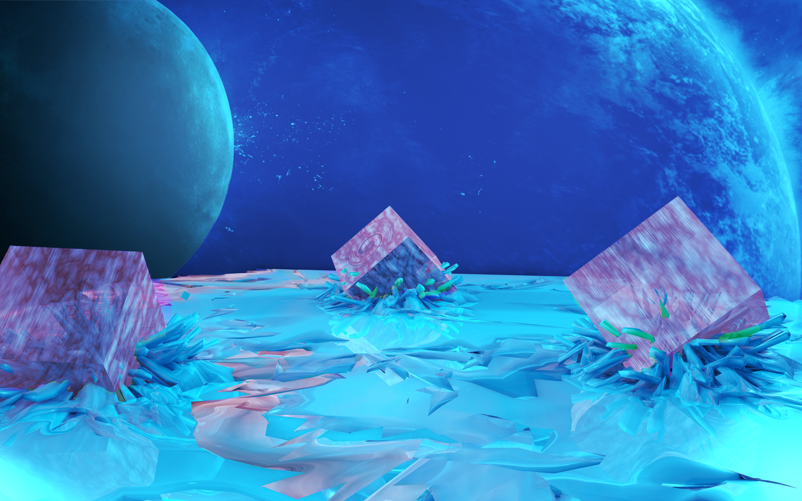

<div align = "center">
  <h1>🚀 Arkanoid JS</h1>
  <h3>Classic Arcade Game Built with Vanilla JavaScript</h3>
  
  [](https://developer.mozilla.org/en-US/docs/Web/JavaScript)
  [](https://developer.mozilla.org/en-US/docs/Web/Guide/HTML/HTML5)
  [](https://developer.mozilla.org/en-US/docs/Web/CSS)

  
  
  [](https://archiedev242.github.io/arcanoid_js/)
</div>

## 🎮 About the Game

Arkanoid JS is a modern reimagining of the classic arcade game, built from scratch using pure JavaScript, HTML5 Canvas, and CSS. This project represents my first major foray into game development and web technologies during my studies at IT-Start programming courses.

Experience the nostalgic gameplay with smooth controls, vibrant visuals, and challenging levels that will test your reflexes and strategy.

## ✨ Key Features

<div style = "display: grid; grid-template-columns: repeat(auto-fit, minmax(250px, 1fr)); gap: 15px; margin: 20px 0;">
  <div style = "background: #1e1e2e; padding: 15px; border-radius: 8px; border-left: 4px solid #89b4fa;">
    <h3>🎮 Classic Gameplay</h3>
    <p>Faithful to the original Arkanoid experience with precise controls and physics</p>
  </div>
  <div style = "background: #1e1e2e; padding: 15px; border-radius: 8px; border-left: 4px solid #f38ba8;">
    <h3>🏆 Progressive Difficulty</h3>
    <p>Multiple levels with increasing challenge and unique brick patterns</p>
  </div>
  <div style = "background: #1e1e2e; padding: 15px; border-radius: 8px; border-left: 4px solid #a6e3a1;">
    <h3>📊 Score System</h3>
    <p>Track your high scores and compete with friends</p>
  </div>
  <div style = "background: #1e1e2e; padding: 15px; border-radius: 8px; border-left: 4px solid #f9e2af;">
    <h3>🎨 Modern Design</h3>
    <p>Sleek, responsive interface with smooth animations</p>
  </div>
</div>

## 🚀 Quick Start

1. Download or clone the repository
2. Open `index.html` in your web browser
3. Start playing!

Or play directly in your browser: [Play Now](https://archiedev242.github.io/arcanoid_js/)

## 🎮 Game Controls

<div style = "background: #1e1e2e; padding: 20px; border-radius: 8px; margin: 15px 0;">
  <div style = "display: flex; justify-content: space-around; flex-wrap: wrap; gap: 15px;">
    <div style = "text-align: center;">
      <div style = "background: #313244; padding: 10px 20px; border-radius: 6px; margin-bottom: 8px;">
        <kbd>←</kbd> <kbd>→</kbd>
      </div>
      <p>Move platform</p>
    </div>
    <div style = "text-align: center;">
      <div style = "background: #313244; padding: 10px 20px; border-radius: 6px; margin-bottom: 8px;">
        <kbd>SPACE</kbd>
      </div>
      <p>Launch ball</p>
    </div>
  </div>
</div>

## 🛠️ Project Structure

```
arcanoid_js/
├── index.html          # Main HTML file
├── game.js            # Core game logic and mechanics
├── main.css           # Styling and animations
└── img/               # Game assets
    ├── background.png # Game background
    ├── ball.png      # Ball sprite
    ├── block.png     # Brick sprites
    └── platform.png  # Player platform
```

## 🧑‍💻 Technology Stack

<div style = "display: flex; flex-wrap: wrap; gap: 15px; margin: 20px 0;">
  <div style = "flex: 1; min-width: 200px; background: #1e1e2e; padding: 15px; border-radius: 8px;">
    <h3>Frontend</h3>
    <ul>
      <li>HTML5</li>
      <li>CSS3</li>
      <li>JavaScript (ES6+)</li>
    </ul>
  </div>
  <div style = "flex: 1; min-width: 200px; background: #1e1e2e; padding: 15px; border-radius: 8px;">
    <h3>Game Development</h3>
    <ul>
      <li>HTML5 Canvas API</li>
      <li>Object-Oriented Programming</li>
      <li>Game Loop Implementation</li>
    </ul>
  </div>
  <div style = "flex: 1; min-width: 200px; background: #1e1e2e; padding: 15px; border-radius: 8px;">
    <h3>Design Tools</h3>
    <ul>
      <li>Adobe Illustrator (Sprites)</li>
      <li>Cinema 4D (Background)</li>
      <li>Git & GitHub</li>
      <li>Visual Studio Code</li>
      <li>Chrome DevTools</li>
    </ul>
  </div>
</div>

## 🖥️ System Requirements

- **OS**: Windows 10/11, macOS 10.14+, or modern Linux distro
- **Browser**: Latest version of Chrome, Firefox, Safari, or Edge
- **Screen Resolution**: 1920x1080 recommended

## 🚧 Development Roadmap

- [x] Basic game mechanics
- [x] Score system
- [ ] Multiple levels
- [ ] Power-ups
- [ ] Sound effects and music
- [ ] High score leaderboard

## 🤝 Contributing

Contributions are what make the open-source community an amazing place to learn, inspire, and create. Any contributions you make are **greatly appreciated**.

1. Fork the Project
2. Create your Feature Branch (`git checkout -b feature/AmazingFeature`)
3. Commit your Changes (`git commit -m 'Add some AmazingFeature'`)
4. Push to the Branch (`git push origin feature/AmazingFeature`)
5. Open a Pull Request

## 🙏 Acknowledgments

- **IT-Start** - For the amazing programming courses
- **My Mentors** - For their guidance and support
- **The Classic Arkanoid** - For the inspiration
- **You** - For checking out this project!

<div align = "center">
  <p>Made with ❤️ by ArchieDev242</p>
</div>